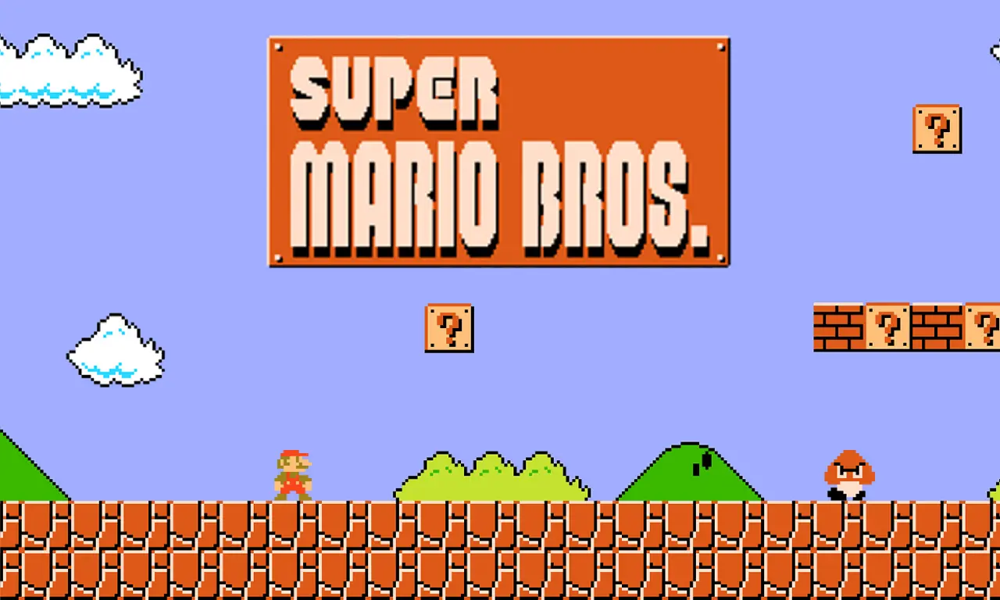
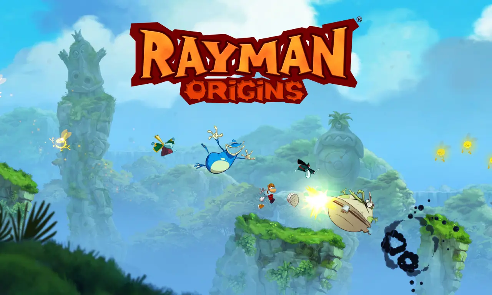
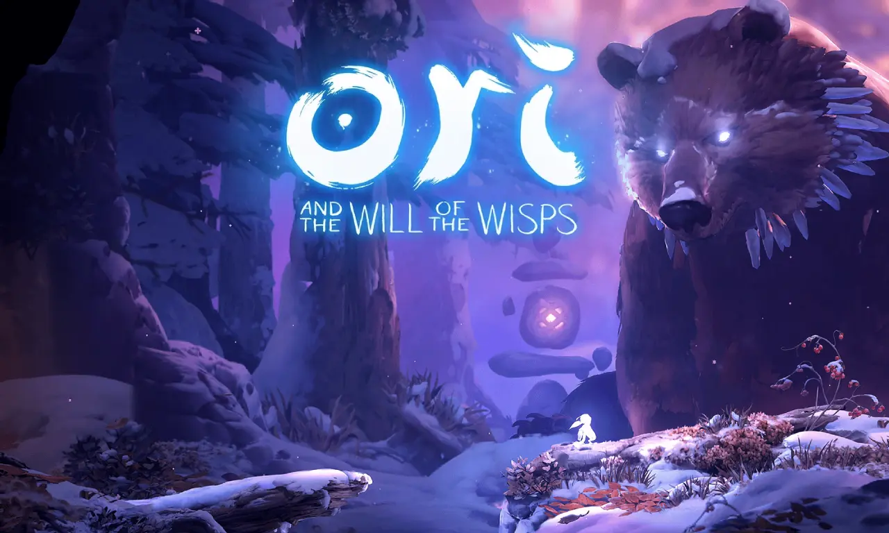

# 2D platformer

## Description

Students will develop a short 2D platformer level focused on gameplay feel, character movement and environment interaction.

The project will include a complete gameplay loop with player movement, jumps, collisions, checkpoints, hazards and a final objective.

The goal is not to create a complete game, but to produce a polished and playable vertical slice demonstrating strong gameplay foundations.

## Learning objectives

- Understand 2D gameplay architecture.
- Implement player movement systems.
- Manage collisions and physics interactions.
- Design a readable level layout.
- Create responsive gameplay feedback.
- Learn the importance of game feel and polish.
- Structure a complete playable prototype.

## Technical requirements

### Mandatory features

- Player movement system.
- Jump system.
- Collision handling.
- Hazards or enemies.
- Checkpoint or respawn system.
- At least one complete level.
- Win condition.
- Main menu.
- Pause menu.
- Game over state.

### Bonus features

- Double jump.
- Wall jump.
- Moving platforms.
- Collectibles.
- Particle effects.
- Sound design.
- Animated environments.
- Dynamic camera effects.

## Learning resources

### Inspiration

#### Foundations of platformer design

- [Super Mario Bros. (1985)]()

    - Simple and readable level design.
    - Introduction to platforming fundamentals.
    - Clear gameplay communication.

#### Evolution of gameplay & presentation

- [Rayman Origins (2011)]()

  - Fluid animation systems.
  - Responsive movement.
  - Strong visual readability.

#### Modern platformer polish

- [Ori And The Will Of The Wisps (2020)]()

  - Advanced movement systems.
  - High-quality visual feedback.
  - Modern gameplay polish and presentation.

#### Indie & small-scale project inspiration

- [Celeste](https://maddymakesgamesinc.itch.io/celeste) (oui, oui 😉)
- [Deepest Sword](https://cosmicadventuresquad.itch.io/deepest-sword)
- [Little Runmo](https://juhosprite.itch.io/little-runmo)
- [Moss Moss](https://noelcody.itch.io/moss-moss)
- [Pikwip](https://cookiecrayon.itch.io/pikwip)
- [Sheepy](https://mrsuicidesheep.itch.io/sheepy)

### Tutorials

- [Créer un jeu en 2D facilement avec Unity](https://www.youtube.com/playlist?list=PLUWxWDlz8PYKnrd27LTqOxL2lr3KhEVRT)
- [Créer un jeu 2D avec Unity 6](https://www.youtube.com/playlist?list=PLpfOedZZax4yclmsmAo4cq203zg3cUjy7)
- [How to make a 2D game in Unity](https://www.youtube.com/playlist?list=PLPV2KyIb3jR6TFcFuzI2bB7TMNIIBpKMQ)
- [Full course on how to make a 2D game in Unity 6](https://www.youtube.com/watch?v=Gz7kuFMggNE)

### Assets

- [Craftpix](https://craftpix.net/?s=platformer)
- [Game Art 2D](https://www.gameart2d.com/#gsc.tab=0&gsc.q=platformer&gsc.sort=)
- [Itch.io](https://itch.io/game-assets/free/genre-platformer)
- [OpenGameArt](https://opengameart.org/art-search?keys=platformer)
- [Unity AssetStore](https://assetstore.unity.com/search#q=platformer&nf-ec_price_filter=0...0)

## Deliverables

Students must provide:

- GitHub repository.
- README documentation.
- Gameplay screenshots or videos.
- Playable build.
- Published [Itch.io](https://itch.io/) page.

## Why this project matters

Platformers are one of the best ways to demonstrate understanding of gameplay fundamentals.

It showcases:

- Movement quality.
- Collision handling.
- Level design understanding.
- Player experience polish.

Recruiters immediately understand the complexity behind a good platformer controller.

## How to present it in recruitment

Students should present this project as:

> A gameplay-focused prototype demonstrating level design, collision systems, player movement and gameplay polish.

Important elements to highlight:

- Responsive controls.
- Satisfying jump feel.
- Clean visual feedback.
- Structured code architecture.
- Polished gameplay loop.

<a href="../curriculum-proposal.md">BACK TO CURRICULUM</a>