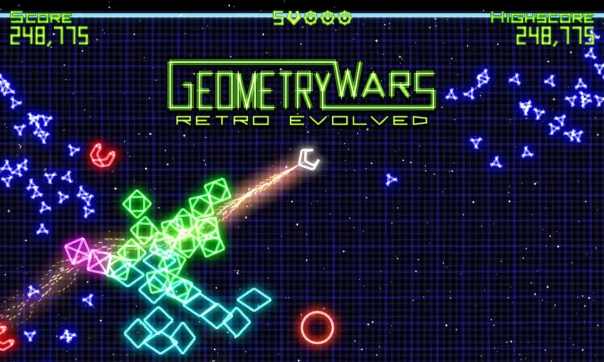
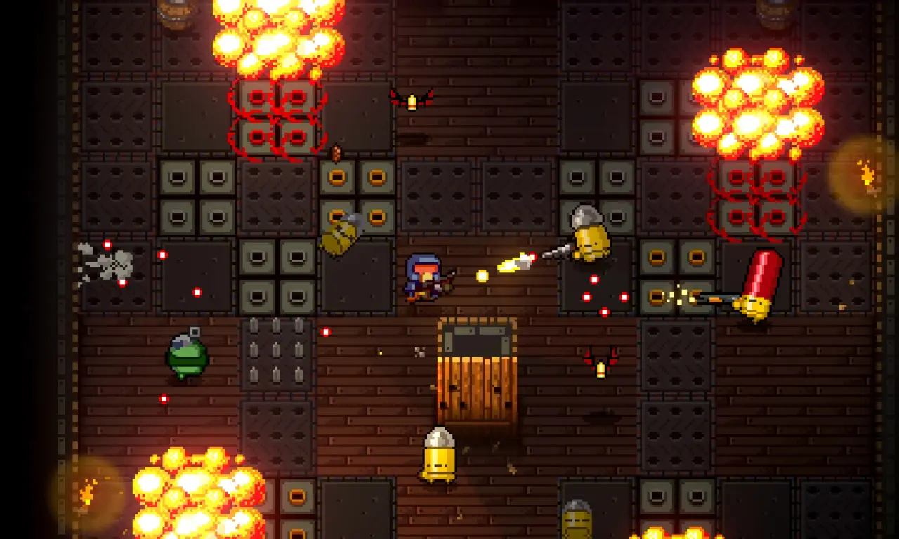
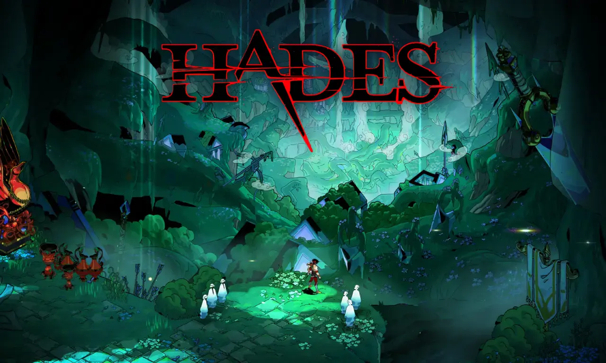

# 2D top-down shooter (twin-stick shooter)

## Description

Students will create a fast-paced arcade shooter viewed from above.

The prototype will include player movement, enemy spawning, player shooting, score systems, visual effects and increasing difficulty over time.

The project should focus heavily on gameplay feedback and game feel.

## Learning objectives

- Manage enemy AI behaviors.
- Implement projectile systems.
- Create gameplay feedback effects.
- Handle scoring and progression systems.
- Improve player responsiveness.
- Learn arcade gameplay balancing.
- Build dynamic gameplay loops.

## Technical requirements

### Mandatory features

- Player movement system.
- Shooting system.
- Enemy spawning system.
- Enemy AI behaviors.
- Score system.
- Game over state.
- Difficulty progression.
- Main menu.
- Pause system.

### Bonus features

- Multiple enemy types.
- Power-ups.
- Combo systems.
- Visual post-processing effects.
- Procedural enemy waves.
- Leaderboard system.
- Local multiplayer.

## Learning resources

### Inspiration

#### Arcade shooter foundations

- [Geometry Wars (2003)]()

    - Fast-paced arcade gameplay.
    - Strong visual feedback systems.
    - Twin-stick shooter fundamentals.
    - Score-focused gameplay loop.

#### Enemy density & combat intensity

- [Enter the Gungeon (2016)]()

    - Bullet pattern design.
    - Enemy variety.
    - Combat readability.
    - Procedural encounter design.

#### Modern indie polish

- [Hades (2020)]()

    - Responsive combat systems.
    - High-quality visual effects.
    - Juice and gameplay feel.
    - Dynamic combat pacing.

#### Indie & small-scale project inspiration

- [Bullet Bunny](https://penusbmic.itch.io/bullet-bunny)
- [Tormental](https://croteam.itch.io/tormental)
- [Vampire Survivors](https://poncle.itch.io/vampire-survivors)
- [Veloce](https://torfi.itch.io/veloce)
- [Windowskill](https://torcado.itch.io/windowkill)
- [You are circle](https://ltjax.itch.io/you-are-circle)

### Tutorials

- [6 steps to make a top down shooter game](https://www.youtube.com/watch?v=BupOVbzijJM)
- [Top down movement in Unity](https://www.youtube.com/watch?v=whzomFgjT50)
- [Top down shooting in Unity](https://www.youtube.com/watch?v=LNLVOjbrQj4)
- [Top down shooter](https://www.youtube.com/playlist?list=PL8Eix6L3QkfOJLaqbXmDV2wc7Um9_aI4c)
- [Twin stick shooter tutorial](https://www.youtube.com/playlist?list=PL0i-Z4pgBZG4Mmuoudp1viLwVZbNMqvby)
- [Unity 2D top down shooter for beginners](https://www.youtube.com/playlist?list=PLx7AKmQhxJFajrXez-0GJgDlKELabQQHT)

### Assets

- [Craftpix](https://craftpix.net/?s=shooter)
- [Game Art 2D](https://www.gameart2d.com/#gsc.tab=0&gsc.q=shooter&gsc.sort=)
- [Itch.io](https://itch.io/game-assets/tag-twin-stick-shooter)
- [OpenGameArt](https://opengameart.org/art-search?keys=shooter)
- [Unity AssetStore](https://assetstore.unity.com/search#q=twin%20stick)

## Deliverables

Students must provide:

- GitHub repository.
- README documentation.
- Gameplay screenshots or videos.
- Playable build.
- Published Itch.io page.

## Why this project matters

Arcade shooters are excellent portfolio pieces because they are immediately playable and visually dynamic.

It showcases:

- Gameplay programming.
- Effects integration.
- Enemy management.
- Balancing.
- Gameplay iteration skills.

It also highlights the student’s ability to create satisfying player interactions.

## How to present it in recruitment

Students should present this prototype as:

> An arcade gameplay project focused on responsiveness, visual feedback and combat systems.

Important elements to highlight:

- Enemy variety.
- Satisfying shooting mechanics.
- Visual effects.
- Scoring systems.
- Gameplay intensity.

<a href="../curriculum-proposal.md">BACK TO CURRICULUM</a>