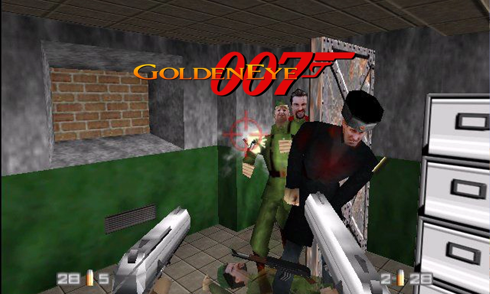
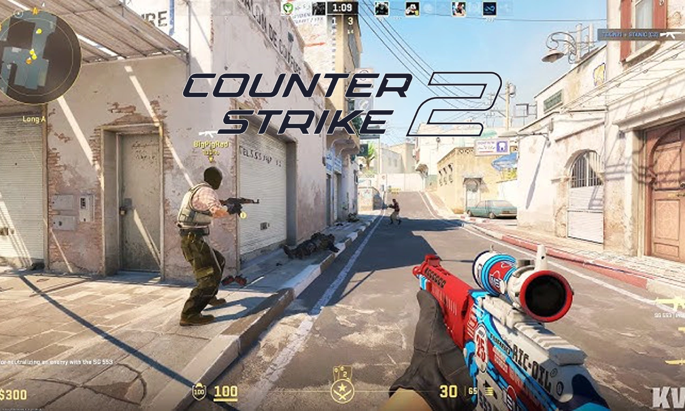
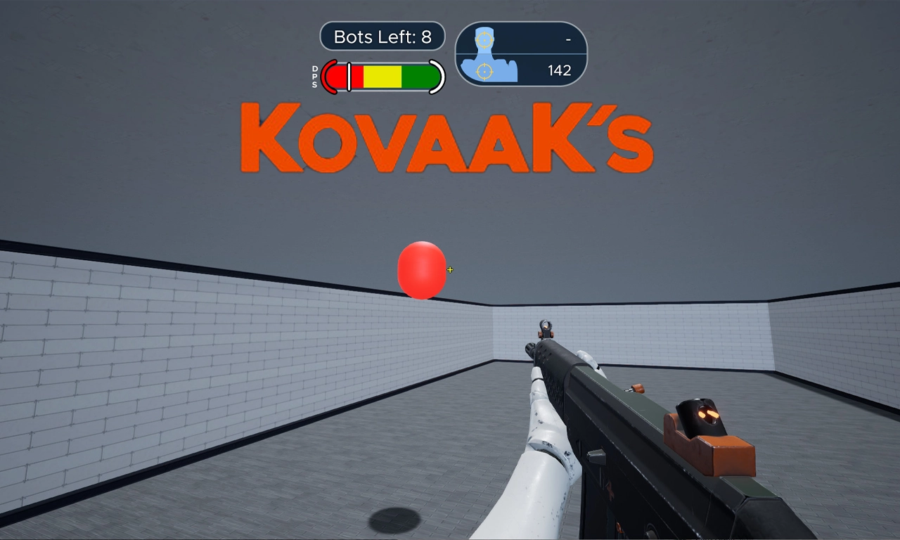

# 3D FPS aim trainer

## Description

Students will create a first-person aim training application inspired by competitive FPS training tools.

The prototype will include targets, timers, scoring systems, accuracy tracking and configurable gameplay modes.

The focus is precision, responsiveness and gameplay metrics.

## Learning objectives

- Implement FPS camera systems.
- Use raycasting systems.
- Create responsive shooting mechanics.
- Develop UI and score tracking systems.
- Manage timing and statistics systems.
- Understand player precision and feedback loops.

## Technical requirements

### Mandatory features

- FPS controller.
- Mouse look system.
- Shooting system.
- Raycasting interactions.
- Score tracking.
- Accuracy statistics.
- Timer system.
- Main menu.

### Bonus features

- Multiple training modes.
- Moving targets.
- Hit markers.
- Audio feedback systems.
- Weapon customization.
- Sensitivity settings.
- Performance graphs.

## Learning resources

### Inspiration

#### Historical foundations of FPS gameplay

- [GoldenEye 007 (1997)](https://www.youtube.com/watch?v=Z5oTkVsTZdI)

    - One of the first major console FPS games.
    - Introduced accessible FPS controls to a mainstream audience.
    - Early implementation of target shooting and player reaction systems.
    - Important milestone in FPS gameplay history.

#### Modern competitive FPS foundations

- [Counter-Strike 2 (2023)](https://www.youtube.com/watch?v=c80dVYcL69E)

    - Precision-focused gunplay.
    - Competitive aiming fundamentals.
    - Fast reaction and positioning systems.
    - Strong emphasis on accuracy and reflexes.

#### Modern aim training reference

- [KovaaK's (2018)](https://www.youtube.com/watch?v=F8NABucEvsU)

    - Industry-standard aim training application.
    - Advanced statistics and precision tracking.
    - Massive library of customizable training scenarios.
    - Widely used by competitive FPS players and esports communities.

#### Indie & small-scale project inspiration

- [Aimlabs](https://store.steampowered.com/app/714010/Aimlabs/)
- [Aim Hero](https://store.steampowered.com/app/518030/Aim_Hero/)
- [Altered Blood +](https://trueworldstudios.itch.io/alteredblood)
- [Red Handed](https://badpiggy.itch.io/red-handed)
- [SuperHot](https://superhot.itch.io/superhot) (oui, oui, ça a commencé sur [Itch.io](https://itch.io/) 😉)
- [Ultrakill](https://hakita.itch.io/ultrakill-prelude)

### Tutorials

- [First person movement in 10 minutes](https://www.youtube.com/watch?v=f473C43s8nE)
- [First person movement in Unity](https://www.youtube.com/watch?v=_QajrabyTJc)
- [First person shooter in Unity 6 ](https://www.youtube.com/watch?v=T9w6s_ETU9Q)
- [First person shooter tutorial series](https://www.youtube.com/playlist?list=PLtLToKUhgzwm1rZnTeWSRAyx9tl8VbGUE)
- [Shooting with Raycasts](https://www.youtube.com/watch?v=THnivyG0Mvo)
- [Unity FPS tutorials](https://www.youtube.com/playlist?list=PLPV2KyIb3jR7dFbE2UQYu7QWMdUgDnlnk)

### Assets

- [Craftpix](https://craftpix.net/?s=&category=211)
- [Game Art 2D](https://www.gameart2d.com/#gsc.tab=0&gsc.q=fps&gsc.sort=)
- [Itch.io](https://itch.io/game-assets/free/tag-fps)
- [OpenGameArt](https://opengameart.org/art-search?keys=fps)
- [Unity AssetStore](https://assetstore.unity.com/search#q=fps)

## Deliverables

Students must provide:

- GitHub repository.
- README documentation.
- Gameplay screenshots or videos.
- Playable build.
- Published [Itch.io](https://itch.io/) page.

## Why this project matters

This project demonstrates strong technical gameplay programming skills.

It showcases:

- FPS architecture.
- Raycasting systems.
- Precision gameplay.
- Statistics systems.
- Responsive interaction design.

It is also highly understandable for recruiters due to its direct gameplay focus.

## How to present it in recruitment

Students should present this project as:

> A gameplay systems prototype focused on FPS interaction, precision systems and player performance tracking.

Important elements to highlight:

- Responsive controls.
- Shooting precision.
- Scoring systems.
- Gameplay metrics.
- Clean FPS architecture.

<a href="../curriculum-proposal.md">BACK TO CURRICULUM</a>