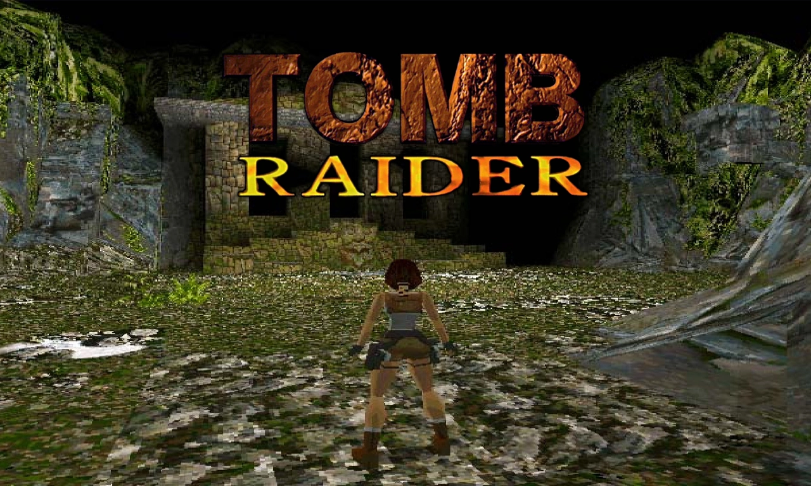
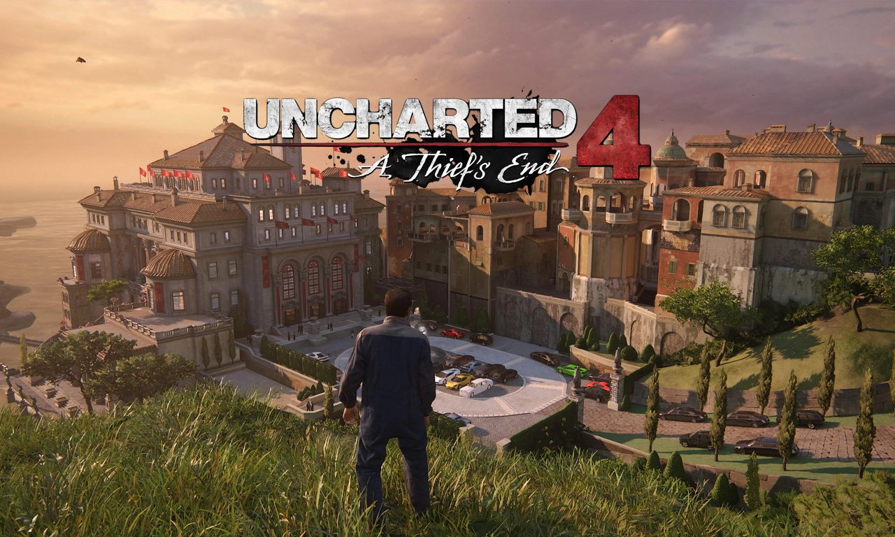
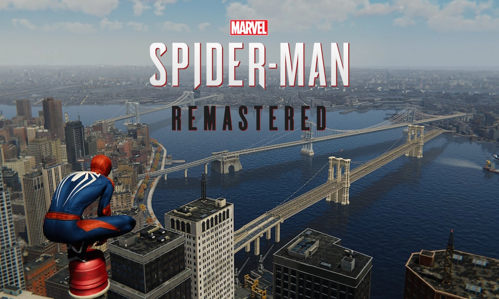

# 3D TPS sandbox

## Description

Students will build a first-person traversal sandbox focused on movement mechanics and environmental navigation.

The prototype may include wall jumps, climbing, sliding, vaulting and vertical traversal systems.

The project should emphasize movement fluidity and level readability.

## Learning objectives

- Develop advanced movement systems.
- Handle complex collisions and physics interactions.
- Build traversal-oriented level design.
- Create fluid gameplay transitions.
- Improve camera movement and player feedback.
- Understand vertical gameplay spaces.

## Technical requirements

### Mandatory features

- Advanced player controller.
- Sprint system.
- Jump system.
- Sliding or crouching system.
- Climbing or vaulting mechanic.
- Traversal-oriented environment.
- Checkpoint system.
- Main menu.

### Bonus Features

- Wall running.
- Grappling hook.
- Dynamic camera effects.
- Time trial mode.
- Replay system.
- Parkour combo system.
- Speedrun timer.

## Learning resources

### Inspiration

#### Historical foundations of traversal gameplay

[Tomb Raider (1996)]()

    - Early third-person traversal gameplay.
    - Environmental navigation and climbing systems.
    - Vertical exploration design.
    - Foundation of modern traversal-oriented games.

#### Cinematic traversal & environmental interaction

[Uncharted 4: A Thief's End (2016)]()

    - Cinematic traversal systems.
    - Advanced climbing and vaulting mechanics.
    - Smooth gameplay-to-animation transitions.
    - Strong environmental readability and pacing.

#### Movement fluidity & sandbox traversal

[Marvel's Spider-Man Remastered (2022)]()

    - Momentum-based traversal systems.
    - Responsive player movement.
    - Strong camera management.
    - Open traversal sandbox design.

### Tutorials

- [Create a 3rd person controller in Unity](https://www.youtube.com/playlist?list=PLD_vBJjpCwJsqpD8QRPNPMfVUpPFLVGg4)
- [Créer un contrôleur à la troisième personne dans Unity à partir de zéro](https://www.youtube.com/watch?v=DXw9QhsjlME)
- [Making Survival-shooter game in Unity](https://www.youtube.com/playlist?list=PLDVrbPbYnQv1zhgBmFKX7rWCtw7fBaj9I)
- [Mettre en place n'importe quel personnage à la troisième personne](https://www.youtube.com/watch?v=V63_SvI5yY4)
- [Unity 3D TPS controller](https://www.youtube.com/playlist?list=PLVko8yLzEsQJRX18_SuS3DhVbD-D4WRDz)

### Assets

- [Craftpix](https://craftpix.net/categorys/3d-game-assets/)
- [Game Art 2D](https://www.gameart2d.com/#gsc.tab=0&gsc.q=3d&gsc.sort=)
- [Itch.io](https://itch.io/game-assets/tag-third-person-shooter)
- [OpenGameArt](https://opengameart.org/art-search?keys=third+person)
- [Unity AssetStore](https://assetstore.unity.com/search#q=third%20person)

## Deliverables

Students must provide:

- GitHub repository.
- README documentation.
- Gameplay screenshots or videos.
- Playable build.
- Published Itch.io page.

## Why this project matters

Traversal systems are highly valued because they demonstrate advanced gameplay programming capabilities.

It showcases:

- Movement programming.
- Environmental interaction.
- Collision systems.
- Advanced player control systems.
- Gameplay polish.

It also creates highly visual and impressive portfolio footage.

## How to present it in recruitment

Students should present this prototype as:

> A movement-focused sandbox demonstrating advanced traversal systems and first-person gameplay mechanics.

Important elements to highlight:

- Fluid movement.
- Traversal chaining.
- Responsive controls.
- Vertical level design.
- Gameplay polish and readability.

<a href="../curriculum-proposal.md">BACK TO CURRICULUM</a>